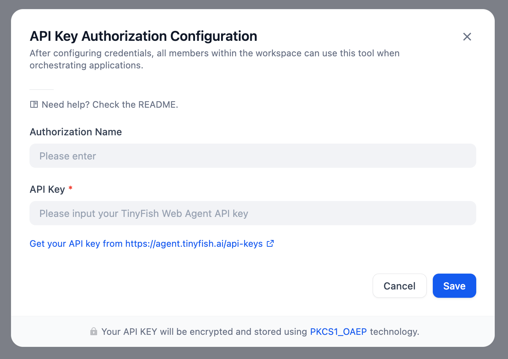
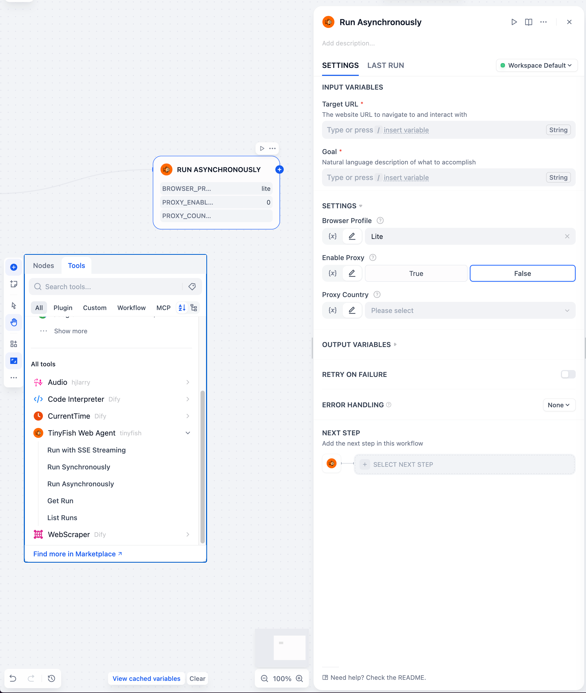
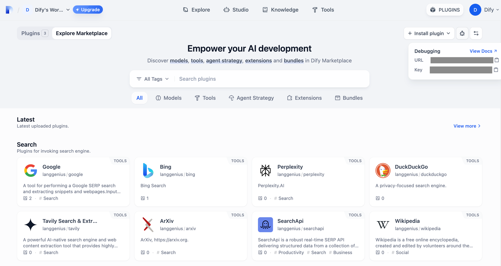
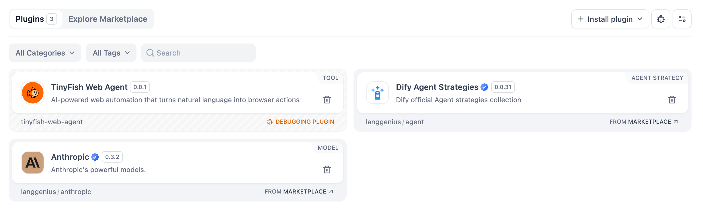

# TinyFish Web Agent Plugin for Dify

## Overview

[TinyFish Web Agent](https://docs.mino.ai/) enables enterprises, builders, and developers to deploy AI agents that navigate real sites, complete real workflows across authenticated systems and dynamic interfaces, and return structured operational intelligence - through our visual platform or API. At scale. Reliably.

## Configuration

### 1. Install TinyFish Web Agent Tool

1. On the Dify platform, access the [Plugin Marketplace](https://docs.dify.ai/plugins/quick-start/install-plugins#marketplace).
2. Locate and install the TinyFish Web Agent tool.

### 2. Create an TinyFish Web Agent API Key

Visit [TinyFish Dashboard](https://agent.tinyfish.ai/api-keys) and generate your API key.

### 3. Authorize TinyFish Web Agent

Go to **Plugins > TinyFish Web Agent > To Authorize** in Dify and input your API key.



## Workflow Usage

Integrate TinyFish Web Agent into your pipeline by following these steps:

1. Add TinyFish Web Agent's **Run Asynchronously** tool to your pipeline.
2. Configure input variables in the tool's UI.
3. Run the pipeline to extract any information from a web page.



## Agent Usage

1. Add all TinyFish Web Agent tools to your Agent app.
2. Prompt the Agent to perform web automations using natural language. The Agent will choose the appropriate tool automatically.

**Available tools:**

| Tool                       | Description                                                                                           |
| -------------------------- | ----------------------------------------------------------------------------------------------------- |
| **Run Synchronously**      | Execute browser automation and wait for the result in a single response.                              |
| **Run Asynchronously**     | Start browser automation and return a `run_id` immediately. Use with **Get Run** to poll for results. |
| **Run with SSE Streaming** | Execute browser automation with real-time progress updates via Server-Sent Events.                    |
| **List Runs**              | List previous automation runs, with optional status filtering and pagination.                         |
| **Get Run**                | Get detailed information about a specific automation run by its ID.                                   |

**Example prompts:**

- `"Extract the blog post titles and authors from https://example.com/blog"`
- `"Go to https://example.com/pricing and extract all plan names and prices"`
- `"List my recent automation runs that have completed"`

## Debugging the Plugin

Dify provides a remote debugging method.

### 1. Get debugging key and server address

On the platform, go to the "Plugin Management" page to get the debugging key and remote server address.



### 2. Add server and key to your environment

Go back to the plugin project, copy the `.env.example` file and rename it to .env. Fill it with the remote server address and debugging key.

The `.env` file:

```bash
INSTALL_METHOD=remote
REMOTE_INSTALL_URL=debug.dify.ai:5003
REMOTE_INSTALL_KEY=********-****-****-****-************
```

### 3. Launch the plugin

Run the `python -m main` command to launch the plugin. You can see on the plugin page that the plugin has been installed into Workspace.



## Contributing

We love getting contributions! To get started, here's how to set up development for the TinyFish Web Agent Dify Plugin:

### 1. Fork this repository

### 2. Clone the repository

Clone the forked repository from your terminal:

```shell
git clone git@github.com:<github_username>/tinyfish-web-agent-integrations.git
```

### 3. Install dependencies with virtual environment (Recommended)

```shell
python -m venv .venv
source .venv/bin/activate
pip install -r requirements.txt
```

### 4. Make your changes and save

### 5. Ensure the plugin works

See the previous [Debugging Guide](#debugging-the-plugin).

### 6. Submit a Pull Request

After confirming that the plugin works properly, submit a pull request to the `main` branch of this repository. If you run into issues like merge conflicts or don't know how to open a pull request, check out [GitHub's pull request tutorial](https://docs.github.com/en/pull-requests/collaborating-with-pull-requests).

## Support

Need help or have a question while using or contributing to the plugin? File a GitHub issue.
