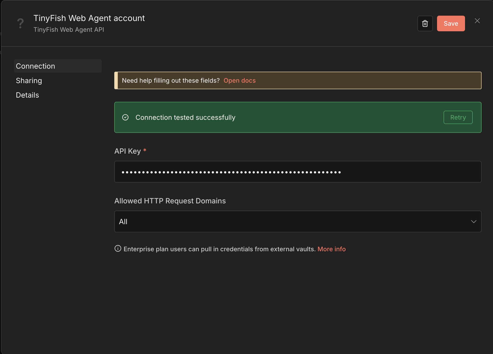
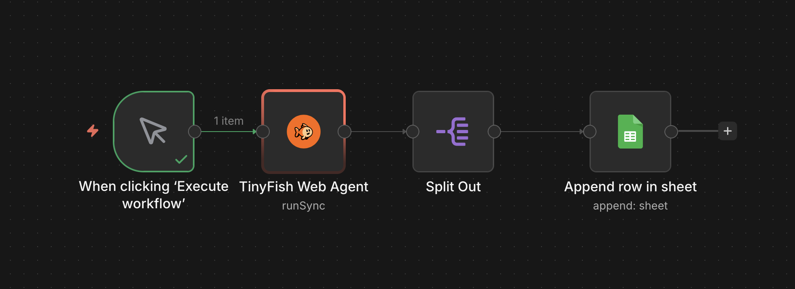

# TinyFish Web Agent Node for n8n

## Overview

[TinyFish Web Agent](https://docs.mino.ai/) enables enterprises, builders, and developers to deploy AI agents that navigate real sites, complete real workflows across authenticated systems and dynamic interfaces, and return structured operational intelligence - through our visual platform or API. At scale. Reliably.

## Configuration

### 1. Install TinyFish Web Agent Node

In your n8n instance, go to **Settings > Community Nodes** and install:

```text
n8n-nodes-tinyfish
```

Or install via npm in a self-hosted instance:

```bash
npm install n8n-nodes-tinyfish
```

### 2. Create a TinyFish Web Agent API Key

Visit [TinyFish Dashboard](https://agent.tinyfish.ai/api-keys) and generate your API key.

### 3. Authorize TinyFish Web Agent

Add the **TinyFish Web Agent** node to a workflow, click the **Credential** dropdown, and select **Create New Credential**. Paste your API key and click **Save**.



## Workflow Usage

Integrate TinyFish Web Agent into your pipeline by following these steps:

1. Add the **TinyFish Web Agent** node to your workflow.
2. Select an operation and fill in the **URL** and **Goal** fields.
3. Run the workflow to extract any information from a web page.

<p align="center">
  
</p>

For example, to extract the top headlines from Hacker News:

- **URL:** `https://news.ycombinator.com`
- **Goal:** `Get the top 5 headlines with their scores and comment counts. Return as a JSON array with keys: title, score, comments.`

The node returns structured JSON:

```json
{
  "status": "COMPLETED",
  "runId": "run_abc123",
  "streamingUrl": "https://...",
  "resultJson": [
    { "title": "Show HN: ...", "score": 142, "comments": 58 },
    { "title": "Launch HN: ...", "score": 98, "comments": 33 }
  ]
}
```

The structured output can be piped into downstream n8n nodes — split the results, send Slack alerts, append rows to Google Sheets, or feed data into any other integration.



## Agent Usage

This node is compatible with n8n's AI Agent via `usableAsTool`. Give your agent the ability to browse the live web, extract data, and act on it.

1. Add the **TinyFish Web Agent** node to your workflow as a tool.
2. Prompt the Agent to perform web automations using natural language. The Agent will fill in the URL and Goal automatically.

**Example prompts:**

- `"Extract the blog post titles and authors from https://example.com/blog"`
- `"Go to https://example.com/pricing and extract all plan names and prices"`
- `"List my recent automation runs that have completed"`

## Operations

| Operation | Description |
|---|---|
| **Run (SSE Streaming)** | Execute automation with real-time streaming and return the final result. Recommended for most use cases. |
| **Run (Sync)** | Execute automation and wait for the complete result in a single response. |
| **Run (Async)** | Start automation and return a run ID immediately. Use with **Get Run** to poll for results. Best for batch processing multiple URLs in parallel. |
| **Get Run** | Get the status and result of an automation run by ID. |
| **List Runs** | List previous automation runs with optional status filter. |

## Options

All run operations support the following optional settings under **Add Option**:

| Option | Default | Description |
|---|---|---|
| **Browser Profile** | `Lite` | Choose between `Lite` (fast, for standard sites) and `Stealth` (anti-detection mode for sites protected by Cloudflare, DataDome, CAPTCHAs, etc.). Start with Lite and switch to Stealth if you get blocked or see access denied errors. |
| **Enable Proxy** | Off | Route the browser through a geographic proxy. Recommended when using Stealth mode on geo-restricted or bot-protected sites. Available countries: US, GB, CA, DE, FR, JP, AU. |
| **Proxy Country** | US | Select the geographic location for the proxy. Only shown when Enable Proxy is turned on. Choose the country closest to the target site's expected region for best results. |
| **Timeout** | 300s | Maximum time to wait for the automation to complete (30–600 seconds). Most tasks complete within 60–120 seconds. Increase for complex multi-step workflows like pagination or form filling. |

## Use Cases

- **Competitive Price Monitoring:** Extract pricing data from competitor product pages in parallel and feed it into downstream n8n nodes (e.g., Slack alerts, Google Sheets).
- **AI Agent Web Access:** Give your n8n AI Agent the ability to browse the live web, extract data, and act on it.
- **Lead Generation:** Run agents in parallel across a list of company URLs to extract contact information into a structured format.

## Contributing

We love getting contributions! To get started, here's how to set up development for the TinyFish Web Agent n8n Node:

### 1. Fork this repository

### 2. Clone the repository

Clone the forked repository from your terminal:

```shell
git clone git@github.com:<github_username>/tinyfish-web-agent-integrations.git
```

### 3. Install dependencies

```shell
cd n8n
npm install
```

### 4. Build and link for local testing

```shell
npm run build
npm link
```

Then in your n8n installation directory:

```shell
npm link n8n-nodes-tinyfish
```

Restart n8n to load the node.

### 5. Make your changes and save

### 6. Ensure the node works

Rebuild and restart n8n after each change:

```shell
npm run build
# restart n8n
```

### 7. Submit a Pull Request

After confirming that the node works properly, submit a pull request to the `main` branch of this repository. If you run into issues like merge conflicts or don't know how to open a pull request, check out [GitHub's pull request tutorial](https://docs.github.com/en/pull-requests/collaborating-with-pull-requests).

## Resources

- [Documentation](https://docs.mino.ai/)
- [Cookbook](https://github.com/tinyfish-io/tinyfish-cookbook)
- [Templates](https://agent.tinyfish.ai/examples)

## Support

Need help or have a question while using or contributing to the node? File a GitHub issue.
